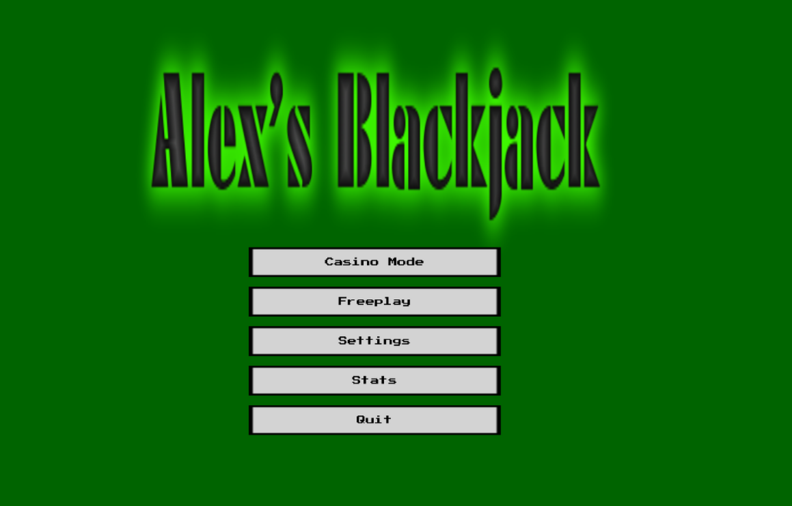
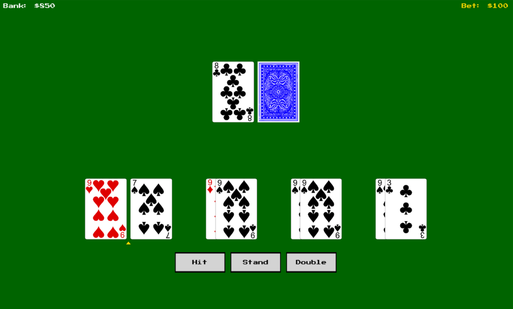

# MonoBlackjack

.NET 10 and Mono 3.8.4

When I was first learning C++ in 2022, I wrote console a Blackjack. I later rewrote in C# and started this project in 2023 as I was interested in game development. 
My vision now is to turn it into a Retro Style Casino-Grade Blackjack game with training and data features

Features:
- Cryptograhic casino-grade shuffling
- Configurable blackjack payouts (3:2, 6:5)
- Configurable shoe size (1 - 1000 decks)
- Cross-platform 
- Retro feel
- Lightweight and highly perfomant
- Clean architecture
- Domain Driven Design
- Event driven architecture
- Unit tests

Planned:
- Sounds
- Animations
- Blackjack Assisstant
- 
  

